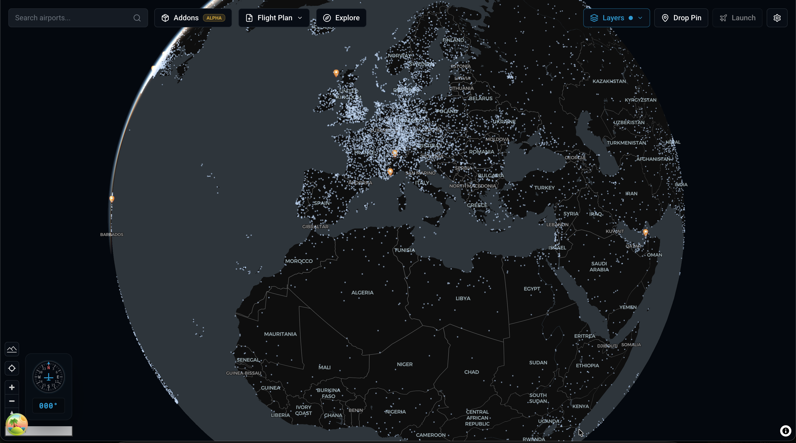
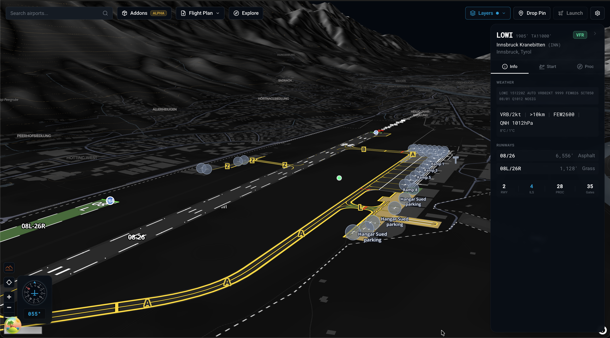
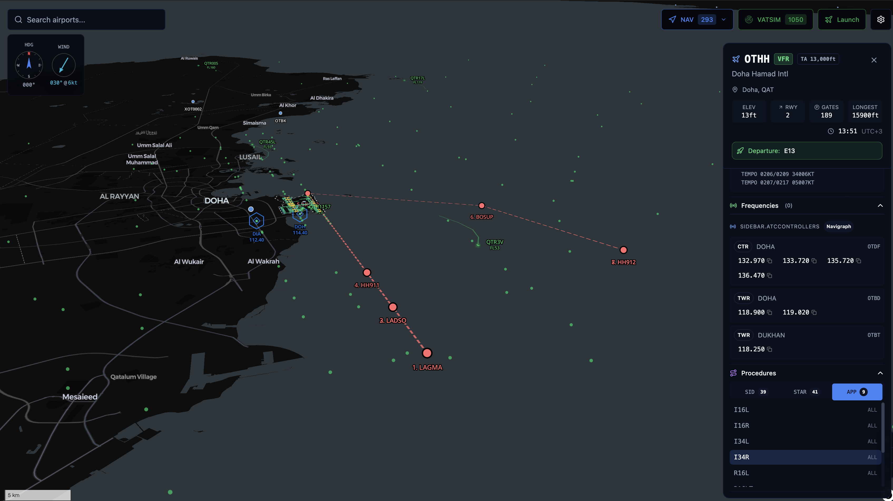
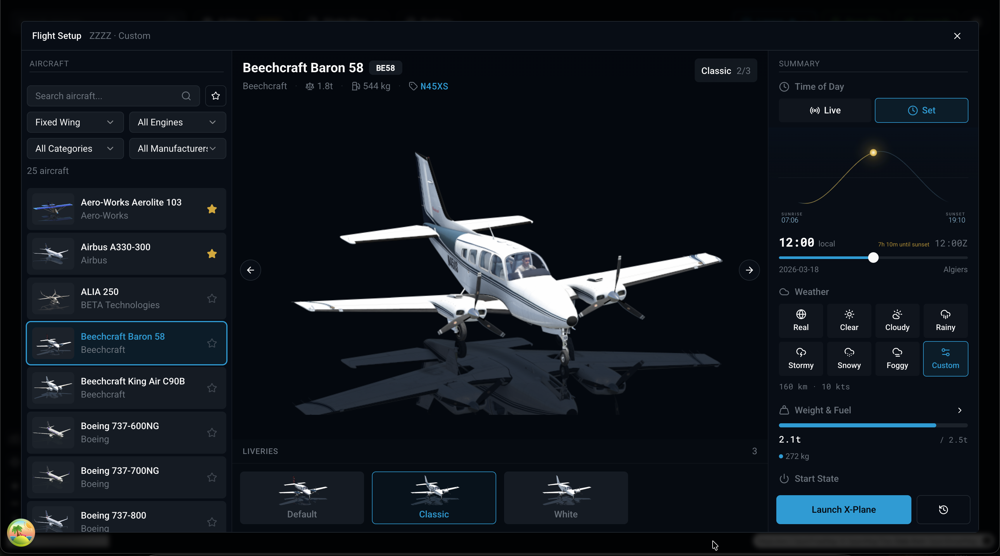
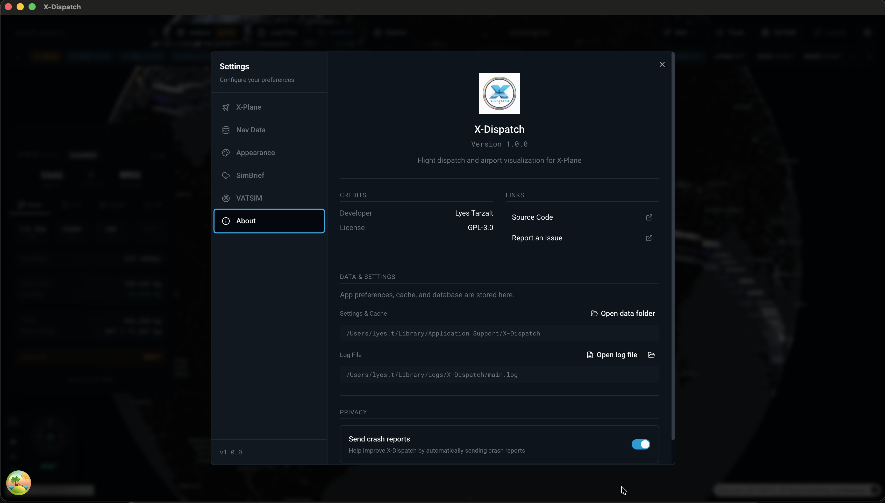
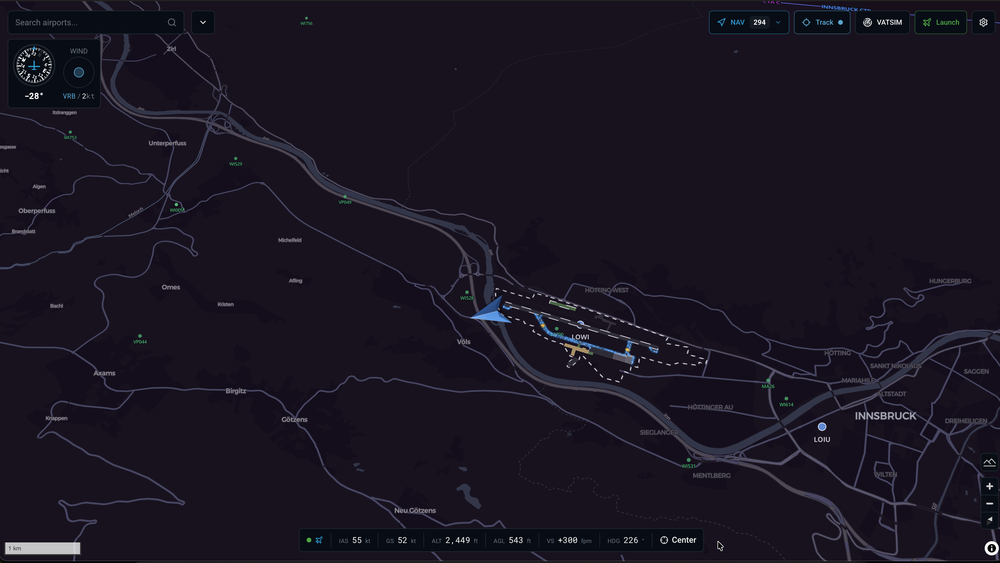

<p align="center">
  
</p>

<h1 align="center">X-Dispatch</h1>

<p align="center">
  Interactive airport map and flight launcher for X-Plane 12
</p>

<p align="center">
  <a href="https://github.com/lyestarzalt/x-dispatch/releases/latest">Download for Windows, macOS, Linux</a>
</p>

> **macOS Users (Sequoia/Tahoe):** The app is unsigned. To install:
>
> 1. Download the `.dmg` from [Releases](https://github.com/lyestarzalt/x-dispatch/releases/latest)
> 2. Drag to Applications and try to open - it will be blocked
> 3. Go to **System Settings → Privacy & Security** → scroll down
> 4. Click **"Open Anyway"** → enter your password
>
> **Or via Terminal:**
>
> ```bash
> xattr -rd com.apple.quarantine /Applications/X-Dispatch.app
> ```
>
> If you get "Permission denied", grant Terminal **Full Disk Access** in System Settings → Privacy & Security.

---



X-Plane shows airport diagrams but has no global map to explore and discover airports. You need to already know the ICAO code to load an airport. This app gives you a world map to browse, search, and explore all airports visually.

Click on any airport to see detailed maps with runways, taxiways, gates, and markings. Select a start position, configure your flight, and launch X-Plane directly.

## Screenshots

<details>
<summary>Airport Detail View</summary>



</details>

<details>
<summary>SID/STAR Procedures</summary>



</details>

<details>
<summary>Flight Setup</summary>



</details>

<details>
<summary>Settings</summary>



</details>

<details>
<summary>Live Flight Tracking</summary>



</details>

## Features

### Airport Visualization

- Runways with surface types, dimensions, and lighting
- Taxiways, aprons, and pavement areas
- Runway and taxiway markings
- Signs, windsocks, and airport boundaries
- Runway, taxiway, and approach lighting systems
- Gates and parking positions with heading indicators

### Navigation Data

- VORs, NDBs, DMEs, and ILS/LOC with course lines
- Waypoints and fixes
- High and low altitude airways
- Controlled airspace boundaries
- SID, STAR, and approach procedures with route visualization

### Weather

- Live METAR with decoded wind, visibility, ceiling, clouds, temperature
- TAF forecasts
- Flight category display (VFR/MVFR/IFR/LIFR)

### Live Traffic

- Real-time VATSIM network overlay
- Pilot callsigns, aircraft types, and flight info

### Flight Launcher

- Aircraft browser with search and filtering
- Filter by manufacturer or category
- Favorites system
- Livery selection with previews
- Fuel load configuration
- Time of day with sun position arc
- Weather presets
- Start from any gate or runway
- Direct X-Plane launch

### Live Flight Tracking

- Real-time aircraft position via X-Plane WebSocket API
- Flight info strip: IAS, GS, ALT, AGL, VS, HDG
- Auto-center map on aircraft
- Connection status indicator

### Multiple Installations

- Automatic detection of X-Plane installations
- Easy switching between installations (Demo, Steam, etc.)
- Full data reload on installation change
- Navigraph data detection per installation

### Data Sources

- X-Plane native files (apt.dat, earth_nav.dat, earth_fix.dat, earth_awy.dat, CIFP)
- Navigraph nav data with AIRAC cycle detection
- ATC frequencies (Navigraph)
- Airport metadata with transition altitudes
- Custom scenery airport support

## How It Works

1. Point the app to your X-Plane installation
2. It parses X-Plane's data files (apt.dat, nav data, CIFP procedures) and caches them in SQLite
3. Browse the world map and click any airport
4. The airport renders with full geometry from apt.dat
5. Select a gate or runway, pick your aircraft, configure the flight
6. The app writes a `Freeflight.prf` file and launches X-Plane with your configuration

## Development

### Requirements

- Node.js 20+
- X-Plane 12

### Setup

```bash
npm install
npm start
```

### Build

```bash
npm run make
```

## License

GPL-3.0 - See [LICENSE](LICENSE) for details.
