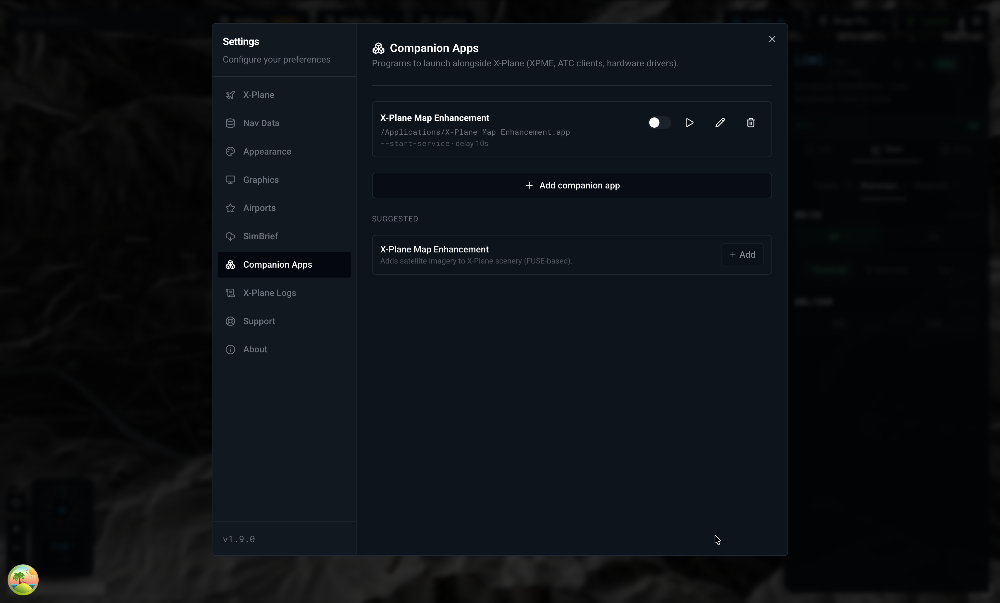

<p align="center">
  
</p>

<h1 align="center">X-Dispatch</h1>

<p align="center">
  Flight dispatch and airport visualization for X-Plane 12
</p>

<p align="center">
  Requires X-Plane 12.4+ · Windows · macOS · Linux
</p>

<p align="center">
  <a href="https://github.com/lyestarzalt/x-dispatch/releases/latest"></a>
  <a href="https://github.com/lyestarzalt/x-dispatch/releases"></a>
  <a href="https://github.com/lyestarzalt/x-dispatch/blob/main/LICENSE"></a>
  <a href="https://github.com/lyestarzalt/x-dispatch/actions/workflows/ci.yml"></a>
  <a href="https://discord.gg/76UYpxXWW7"></a>
  <a href="https://ko-fi.com/lyestarzalt"></a>
</p>

<p align="center">
  <a href="https://x-dispatch.app/download/">Download</a> · <a href="https://x-dispatch.app/">Website</a> · <a href="https://discord.gg/76UYpxXWW7">Discord</a>
</p>

---


All 35,000+ X-Plane airports on a 3D globe. Click one to see runways, taxiways, gates, and markings rendered from X-Plane's apt.dat. Set up your flight, import from SimBrief, and launch X-Plane directly.

## Screenshots


<details>
<summary>More screenshots</summary>





</details>

## What it does

- **Airport map** — 35,000+ airports on a 3D globe with terrain and contour lines. Runways, taxiways, gates, helipads, markings, lights. Custom scenery detection.
- **Flight setup** — Pick your aircraft, livery, starting position, fuel, payload, weather. Launch X-Plane directly or relocate mid-flight.
- **Taxi routing** — Select a gate and runway, get a shortest-path taxi route. Drag to reroute through different taxiways.
- **SimBrief** — Import your OFP. Route goes on the map with fuel breakdown and nav log.
- **Nav data** — VORs, NDBs, ILS, airways, airspace, SID/STAR/approach procedures. Works with Navigraph.
- **Live traffic** — VATSIM and IVAO overlays. Live METAR per airport.
- **Flight tracking** — See your aircraft in real time with a flight strip.
- **Addon manager** — Browse installed aircraft, scenery, plugins. Drag-and-drop install. Scenery priority reordering.

10 languages. Requires X-Plane 12.4+. More details on the [project page](https://x-dispatch.app/).

> **Don't own X-Plane?** X-Plane has a [free demo](https://www.x-plane.com/desktop/try-it/) that works with X-Dispatch, so you can try both.

## Development

```bash
npm install           # install dependencies
npm start             # dev mode with hot reload
npm run start:clean   # fresh start (clears .vite cache)
npm run start:fresh   # dev mode with --reset-cache
npm run make          # build distributables
npm run typecheck     # TypeScript strict mode
npm run lint          # ESLint
npm run lint:fix      # auto-fix lint issues
npm run format        # Prettier
npm run check         # typecheck + lint + format + tests + migrations
npm run test:run      # run Vitest once
```

Electron + React 18 + TypeScript, MapLibre GL JS, Zustand, SQLite. Node.js 22+.

## Support

- [Discord](https://discord.gg/76UYpxXWW7)
- [Issues](https://github.com/lyestarzalt/x-dispatch/issues)

## Donate

X-Dispatch started as a passion project for the X-Plane community and continues to be built with that spirit in mind: free to use, community-focused, and developed in the open. Donations are entirely optional, but they help support continued development.

[](https://ko-fi.com/A0A21V3IZZ)

## Disclaimer

References to X-Plane, SimBrief, Navigraph, VATSIM, and IVAO are for compatibility and identification purposes only. X-Dispatch is an independent community project and is not affiliated with, endorsed by, or sponsored by their respective owners.

## License

Licensed under GPL-3.0-only. See [LICENSE](LICENSE) for the full text.


