<p align="center">
  
</p>

<h1 align="center">X-Dispatch</h1>

<p align="center">
  Flight dispatch, airport visualization, and addon management for X-Plane 12
</p>

<p align="center">
  <a href="https://github.com/lyestarzalt/x-dispatch/releases/latest"></a>
  <a href="https://github.com/lyestarzalt/x-dispatch/releases"></a>
  <a href="https://github.com/lyestarzalt/x-dispatch/blob/main/LICENSE"></a>
  <a href="https://github.com/lyestarzalt/x-dispatch/actions"></a>
  <a href="https://discord.gg/7QBCNv8B"></a>
  <a href="https://ko-fi.com/lyestarzalt"></a>
</p>

<p align="center">
  
  
  
  
</p>

<p align="center">
  <a href="https://github.com/lyestarzalt/x-dispatch/releases/latest">Download for Windows, macOS, Linux</a>
</p>

---

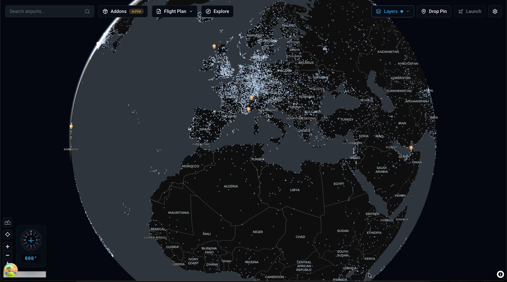

X-Plane has detailed airport data but no global map to explore it. X-Dispatch gives you a 3D globe to browse, search, and discover airports visually. Click any airport to see detailed diagrams with runways, taxiways, gates, and markings. Import your flight plan from SimBrief, select a starting position, configure your flight, and launch X-Plane directly.

If you find this useful, consider giving it a star — it helps others discover the project.

> **macOS Users (Sequoia/Tahoe):** The app is unsigned. After installing, go to **System Settings > Privacy & Security** and click **"Open Anyway"**, or run:
>
> ```bash
> xattr -rd com.apple.quarantine /Applications/X-Dispatch.app
> ```

## Screenshots

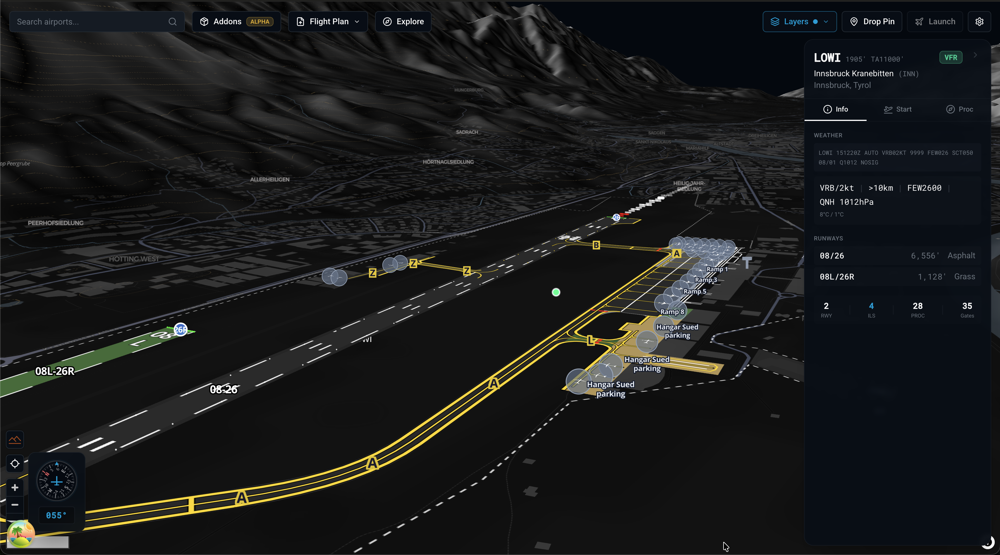
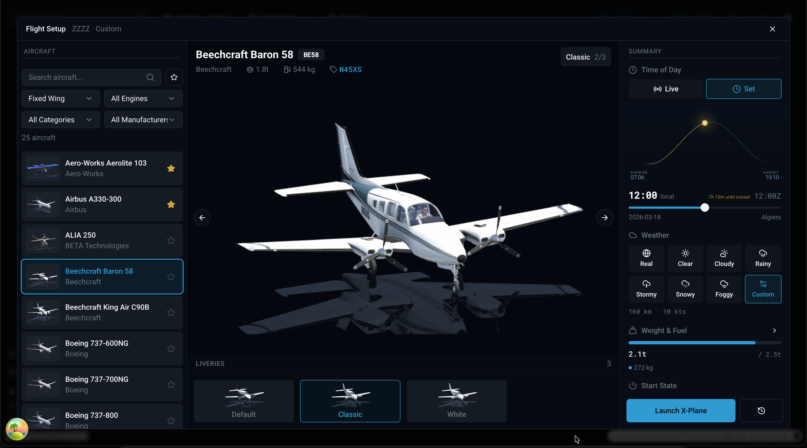

<details>
<summary>SimBrief Integration</summary>

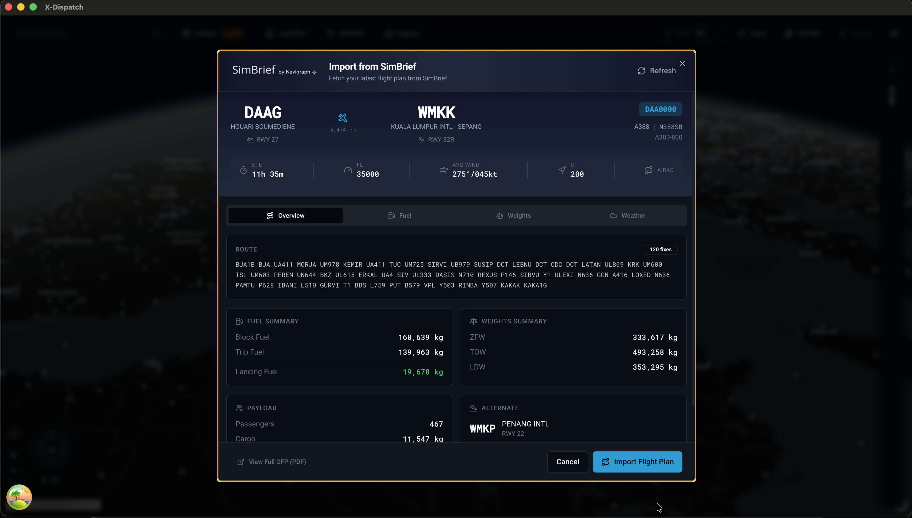
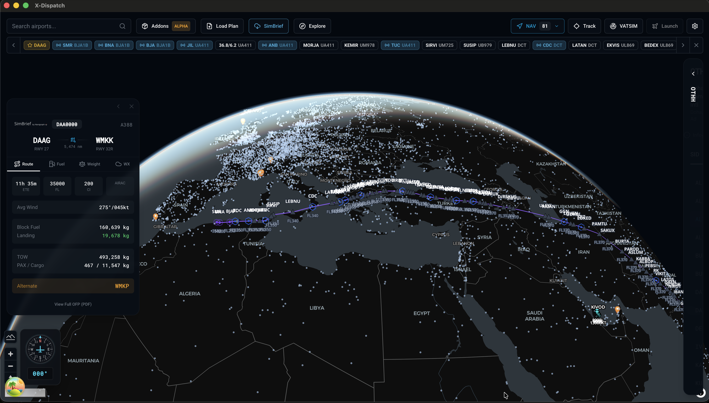

</details>

<details>
<summary>Addon Manager</summary>

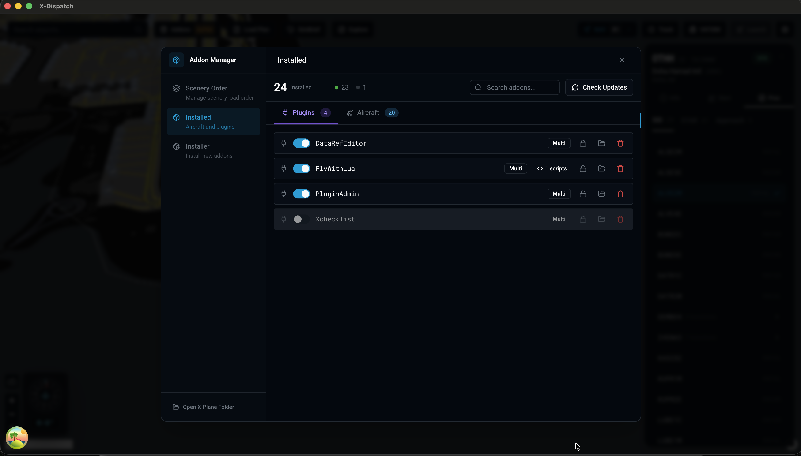
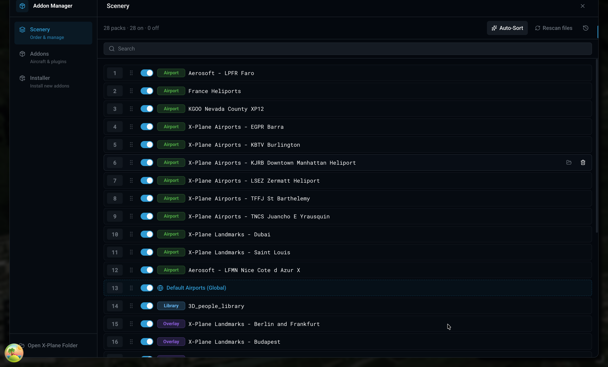

</details>

<details>
<summary>Airport Detail View</summary>


</details>

<details>
<summary>SID/STAR Procedures</summary>

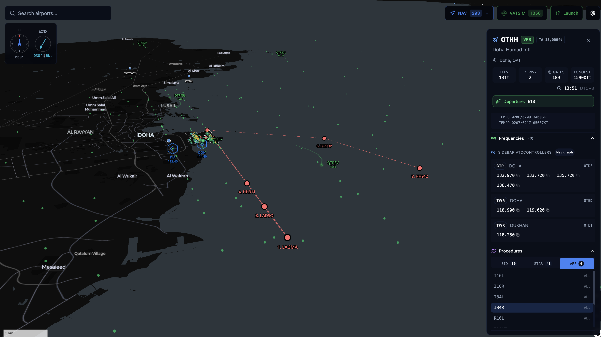

</details>

<details>
<summary>Starting Position</summary>

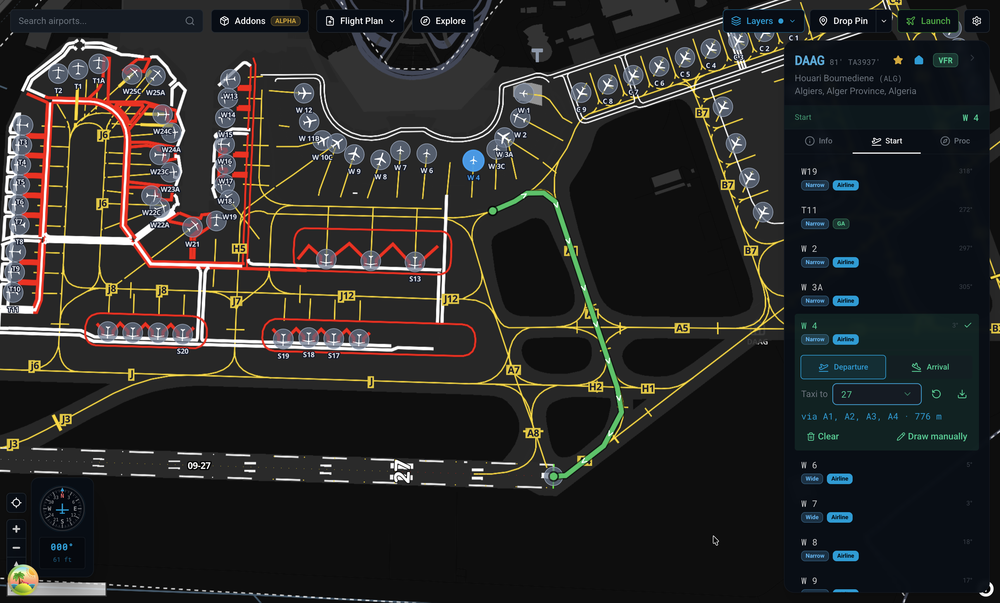

</details>

<details>
<summary>Flight Setup</summary>


</details>

<details>
<summary>Fuel & Payload</summary>

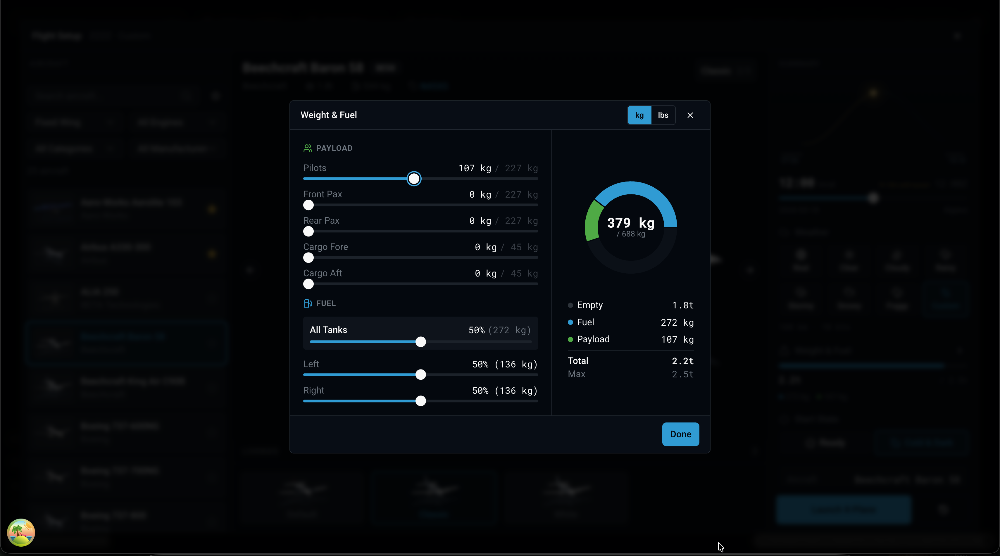

</details>

<details>
<summary>Weather Setup</summary>

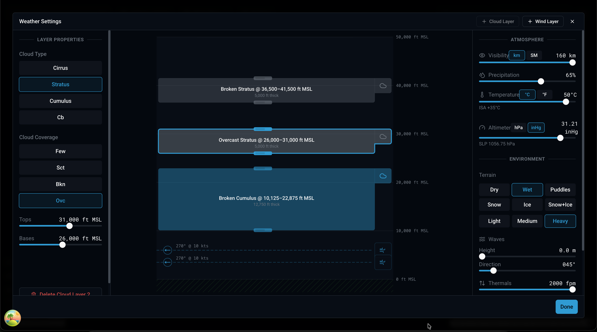

</details>

<details>
<summary>3D Terrain</summary>


</details>

<details>
<summary>Live Flight Tracking</summary>


</details>

<details>
<summary>Flight Plan</summary>

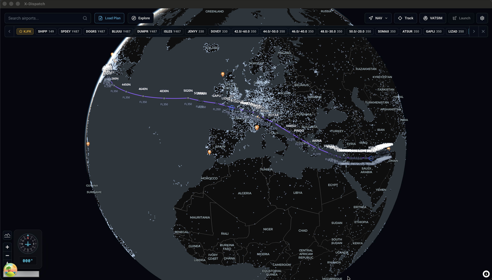

</details>

<details>
<summary>Settings</summary>

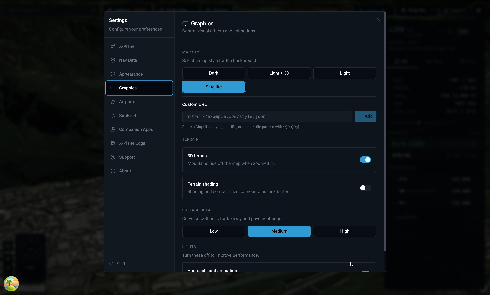

</details>

## Features

### Map & Visualization

- 3D globe with starfield background, terrain elevation, hillshade, and contour lines
- 6 basemap styles (OpenFreeMap, CARTO dark/light variants)
- Airport dots for 35,000+ airports with custom scenery support
- Airport filters by type, runway surface, and country
- Day/night terminator overlay
- Weather radar overlay (RainViewer) with playback controls
- Interactive drag-to-resize range rings with category presets
- Idle orbit camera for selected airports

### Airport Details

- Runways with surface types, dimensions, lighting, and markings
- Taxiways, aprons, and pavement areas with signs
- Gates and parking positions with heading indicators
- Helipads, windsocks, and beacons

### Navigation Data

- VOR, NDB, DME, TACAN, and ILS/LOC with course visualization
- High and low altitude airways
- Controlled airspace boundaries and FIR regions
- SID, STAR, and approach procedures with route overlay
- Range rings showing aircraft reach by category (jet, turboprop, GA)
- X-Plane native data or Navigraph with AIRAC cycle detection

### SimBrief Integration

- One-click OFP import with route visualization on the map
- Fuel breakdown, weight summary, flight times, and nav log
- Waypoint-by-waypoint navigation with map highlighting

### Live Traffic

- VATSIM and IVAO network overlays with pilot callsigns and aircraft types
- Controller and ATIS positions
- Live METAR with decoded weather and flight category display (VFR/MVFR/IFR/LIFR)

### Flight Launcher

- Aircraft browser with search, filters, and favorites
- Livery selection with per-aircraft memory
- Fuel and payload configuration with weight & balance
- Time of day, weather presets, and cold & dark start
- Start from any gate, runway, helipad, or custom pin drop with coordinates
- Air start, carrier catapult, and frigate deck launch modes
- Runway approach start with configurable distance and glider tow
- Direct X-Plane launch or mid-flight relocation via REST API
- Logbook of last 10 flights

### Live Flight Tracking

- Real-time aircraft position via X-Plane WebSocket API
- Flight strip with IAS, GS, altitude, VS, heading, wind, and temperature
- Follow mode to keep the aircraft centered on the map

### Multiple Installations

- Named X-Plane installations with quick switching
- Full data reload on installation change
- Symlink and junction support for addons on external drives
- Version and Steam detection per installation

### Addon Manager

- Browse installed aircraft, plugins, liveries, and Lua scripts
- Scenery priority manager with drag-to-reorder and auto-sort
- One-click install with automatic extraction (ZIP, RAR, 7z)
- Delete scenery from disk with confirmation
- Detects manually added scenery and new addons on rescan

### General

- `xdispatch://` deep link protocol for airport navigation
- Available in 10 languages: English, French, German, Spanish, Italian, Portuguese, Russian, Polish, Japanese, Chinese
- Light, dark, and system theme
- Configurable interface zoom and font size
- Keyboard shortcuts (Ctrl+F for search)

## Development

```bash
npm install      # install dependencies
npm start        # dev mode with hot reload
npm run make     # build distributables
```

```bash
npm run typecheck   # TypeScript strict checks
npm run lint        # ESLint
npm run lint:fix    # auto-fix lint issues
npm run format      # Prettier
```

### Tech Stack

| Layer         | Technology                       |
| ------------- | -------------------------------- |
| Framework     | Electron + React 18 + TypeScript |
| Build         | Vite + Electron Forge            |
| UI            | Tailwind CSS + shadcn/ui         |
| State         | Zustand (persisted stores)       |
| Data Fetching | TanStack Query                   |
| Map           | MapLibre GL JS                   |
| Database      | SQLite (sql.js)                  |

### Project Structure

```
src/
├── components/       # React components (Map, dialogs, panels, layout)
├── config/           # Map styles, zoom behaviors, surface colors
├── hooks/            # Global React hooks
├── lib/
│   ├── parsers/      # X-Plane apt.dat, nav data, METAR, FMS parsers
│   ├── addonManager/ # Aircraft, scenery, plugin management
│   ├── xplaneServices/ # X-Plane REST/WebSocket integration
│   └── geo/          # Geographic calculations
├── queries/          # TanStack Query hooks
├── stores/           # Zustand state stores
├── types/            # TypeScript type definitions
└── db/               # SQLite schema and migrations
```

Requires Node.js 20+ and X-Plane 12.1+.

## Support

- **Discord**: [Join the server](https://discord.gg/7QBCNv8B) for help, feedback, and discussion
- **Issues**: [Open an issue](https://github.com/lyestarzalt/x-dispatch/issues) for bug reports and feature requests
- **Donate**: If you enjoy X-Dispatch, consider [supporting on Ko-fi](https://ko-fi.com/lyestarzalt)

## License

GPL-3.0 — See [LICENSE](LICENSE) for details.
